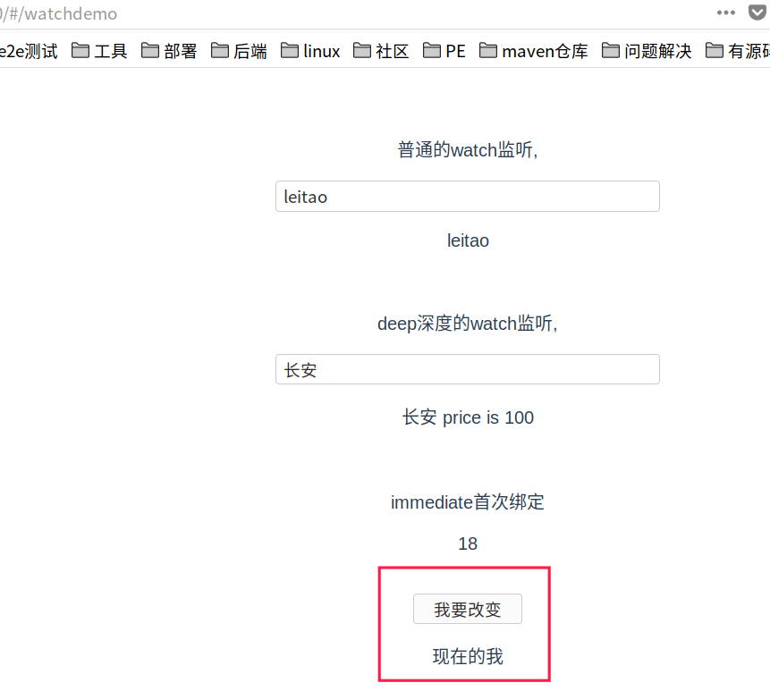
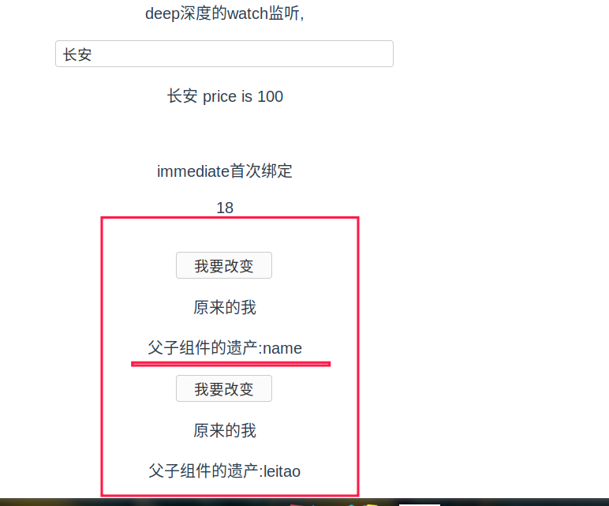
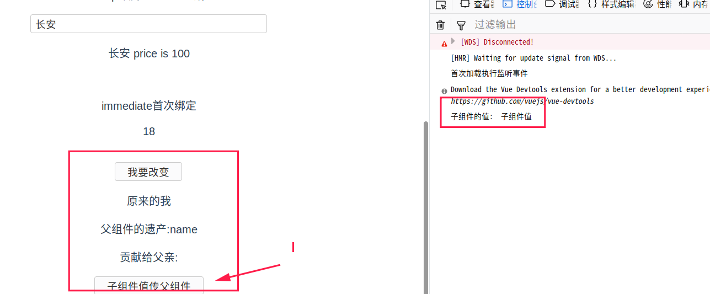

## 5、组件（核心）

组件（Component）是 Vue.js 最强大的功能之一。

组件可以扩展 HTML 元素，封装可重用的代码。

组件系统让我们可以用独立可复用的小组件来构建大型应用

我们将以HelloWorld的项目为例，讲解组件的简单用法。

### 5.1.创建组件

在项目中的components目录下新建一个.vue的文件。这里我在项目中新建了个ShowButton.vue的文件


然后，写入初始化的必要代码(你可以将其写成模板，下次直接使用)：

```vue
<template>
  <div id="ShowButton">
  </div>
</template>

<script>
export default {
  name: 'ShowButton',
  data () {
    return {

    }
  }
}
</script>

```

在<template>中：写要展示的html内容,里面最好再用一个标签将其要展示的内容包起来

name是你的组件名字，建议和文件名保持一致

data要写成函数形式，在里面的return中，添加你需要的数据属性。

这是这个组件最终的内容：

```vue
<template>
  <div id="ShowButton">
    <button @click="myclick">我要改变</button>
    <br/>
    <p>{{message}}</p>
  </div>
</template>

<script>
export default {
  name: 'ShowButton',
  data () {
    return {
      message: '原来的我'
    }
  },
  methods: {
    myclick: function () {
      this.message = '现在的我'
    }
  }
}
</script>
```

### 5.2.引入组件

在<script>的第一行，加入import语句，引入ShowButton组件

然后在vue中的components中，添加此组件

我们将组件引入另一个组件WatchDemo.vue中：

```
// 大致代码如下
<template>
  <div>
    <ShowButton/>
  </div>
</template>

<script>
import ShowButton from './ShowButton'
export default {
  name: 'WatchDemo',
  components: {
    ShowButton
  }
}
</script>

```

具体代码如下：

```vue
<template>
  <div>
    <p>普通的watch监听,</p>
    <input type="text" v-model="name"/>
    <p>{{name}}</p>
    <br/>
    <p>deep深度的watch监听,</p>
    <input type="text" v-model="car.name"/>
    <p>{{car.name}} price is {{car.price}}</p>
    <br/>
    <p>immediate首次绑定</p>
    <p>{{age}}</p>

    <br/>
    <ShowButton/>
  </div>
</template>

<script>
import ShowButton from './ShowButton'
export default {
  name: 'WatchDemo',
  components: {
    ShowButton
  },
  data () {
    return {
      name: 'leitao',
      car: {
        name: '长安',
        price: 100
      },
      age: 18
    }
  },
  watch: {
    // 普通的watch监听,watch的其他参数都使用默认值
    name (newValue, oldValue) {
      console.log('oldValue is : ' + oldValue)
      console.log('name被修改')
      console.log('newValue is : ' + newValue)
    },
    car: {
      handler (newValue, oldValue) {
        console.log('oldValue is : ' + oldValue.name)
        console.log('car.name被修改')
        console.log('newValue is : ' + newValue.name)
      },
      deep: true
    },
    age: {
      handler () {
        console.log('首次加载执行监听事件')
      },
      immediate: true
    }
  }
}
</script>
```

运行结果，可以看见在这个页面中已经引入ShowButton的组件了：



### 5.3.组件数据传递

> **父组件值传递给子组件需要使用 =>props。**

我们上面例子中的ShowButton组件被引入到了WatchDemo组件中，则WatchDemo就是父组件，ShowButton就是子组件，我们将name作为数据传递到子组件中。

**子组件怎么接收数据**

在子组件(ShowButton)中，使用props关键字,以数组的形式添加父组件参数：

```
props:['fatherName']

```

具体代码ShowButton.vue:

```vue
<template>
  <div id="ShowButton">
    <button @click="myclick">我要改变</button>
    <br/>
    <p>{{message}}</p>
    <p>父子组件的遗产:{{fatherName}}</p>
  </div>
</template>

<script>
export default {
  name: 'ShowButton',
  data () {
    return {
      message: '原来的我'
    }
  },
  methods: {
    myclick: function () {
      this.message = '现在的我'
    }
  },
  props: ['fatherName']
}
</script>
```

**父组件怎么传递数据**

在父组件中，在调用子组件的标签中添加属性名,属性名要和子组件中props中的名字一样。形如：

```
// 双引号中的内容将作为实际的值传递，如这里传递到子组件的值就是 name
<ShowButton fatherName="name" />
// 在属性名前面加个冒号，则后面双引号的值表示name对应的data中的属性，它的值就是leitao
<ShowButton :fatherName="name" />

```

运行效果：



> **子组件 -->传值到父组件:$emit**

在子组件中添加一个点击事件，用来传递值给父组件：

```
<p>贡献给父亲:</p>
<input type="button" @click="sendMsg" value="子组件值传父组件">

```

在方法区中添加点击事件，使用$emit方法传递参数：

```
sendMsg: function () {
  this.$emit('childMsg', '子组件值')
}
//  childMsg在父组件作为事件名称

```

在父组件中：

```
// @childMsg为子组件$emit中定义的名字。childEvent为父组件自己事件名
<ShowButton fatherName="name" @childMsg = "childEvent"/>

```

父组件添加方法：

```
methods: {
  childEvent: function (childValue) {
    console.log('子组件的值: ' + childValue)
  }
}

```

运行效果，点击按钮后，控制台输出日志：



> **Prop 验证**

组件可以为 props 指定验证要求。

为了定制 prop 的验证方式，你可以为 props 中的值提供一个带有验证需求的对象，而不是一个字符串数组。例如：

```
props: {
    // 基础的类型检查 (`null` 和 `undefined` 会通过任何类型验证)
    propA: Number,
    // 多个可能的类型
    propB: [String, Number],
    // 必填的字符串
    propC: {
      type: String,
      required: true
    },
    // 带有默认值的数字
    propD: {
      type: Number,
      default: 100
    },
    // 带有默认值的对象
    propE: {
      type: Object,
      // 对象或数组默认值必须从一个工厂函数获取
      default: function () {
        return { message: 'hello' }
      }
    },
    // 自定义验证函数
    propF: {
      validator: function (value) {
        // 这个值必须匹配下列字符串中的一个
        return ['success', 'warning', 'danger'].indexOf(value) !== -1
      }
    }
  }

```

