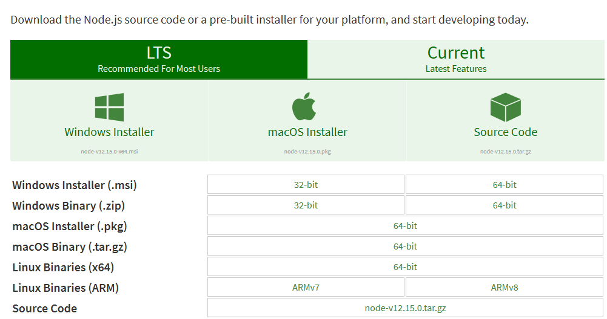
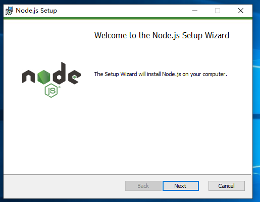
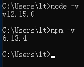
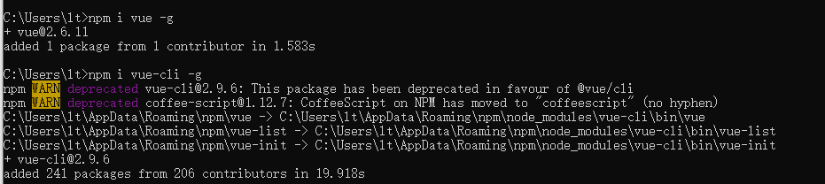
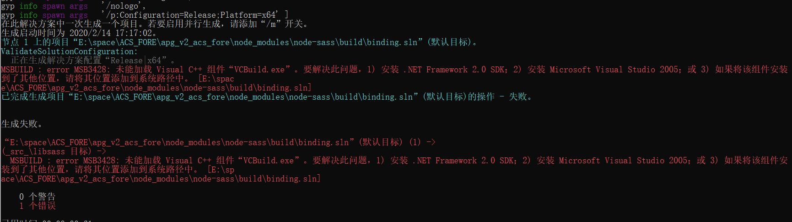
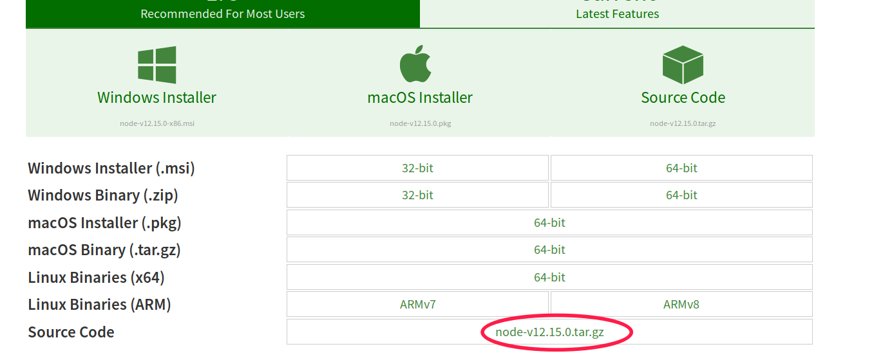
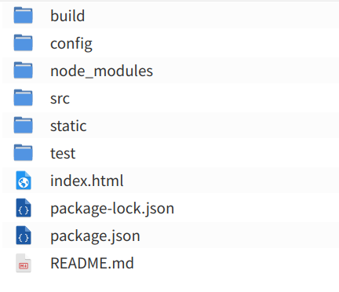
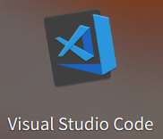

## 2、环境准备以及安装


> 我们将搭建基于webpack脚手架的vue的开发环境。
> 其中需要准备安装的工具有：nodejs、webpack、vue、vue-cli

​     

|  工具   |                             简介                             |
| :-----: | :----------------------------------------------------------: |
| nodejs  | 简单的说 Node.js 就是运行在服务端的 JavaScript。其中已经里面包含了npm |
| webpack | 是一个前端资源加载/打包工具，只需要相对简单的配置就可以提供前端工程化需要的各种功能。 |
| vue-cli | Vue.js 提供的一个官方命令行工具，可用于快速搭建大型单页应用。 可以轻松的创建新的应用程序而且可用于自动生成vue和webpack的项目模板。 |


### 2.1.windows系统中安装

- **安装Nodejs**

  **下载**对应的版本：<https://nodejs.org/en/download/>。 或者去中心内网中下载：http://ftp.cqrd.com/software/nodejs

  我这里下载的是Windows Installer (.msi) 64-bit的

  

  根据提示一步步安装下去

  

  安装完成后在cmd命令行输入命令查看时候安装成功, 安装成功则回显示版本号：

  \>node -v

  \>npm -v

  

  **配置镜像源**

  由于npm的默认镜像源下载太慢，可以配置淘宝镜像源，配置命令如下：

  ```
  npm config set registry https://registry.npm.taobao.org
  ```

  或者或者我们中心内网的镜像源：

  ```
  npm config set registry http://nexusproxy.paas.x/repository/npm-group/
  npm config set @cqrd:registry http://172.26.1.6:30527/repository/npm-hosted/
  ```

- **全局安装webpack**
  在cmd命令行中输入：

  ```
  > npm i webpack -g
  > npm i webpack-cli -g
  ```

  没有error报错即安装成功

- **全局安装vue、vue-cli**

  ```
  npm i vue -g
  npm i vue-cli -g
  ```

  安装成功如下图所示：

  

  

  如果在windos中，`npm install`出现了以下异常：

  

  解决方法：

  是由于sass没有安装成功。

  输入命令：

  ```
  npm i node-sass --sass_binary_site=https://npm.taobao.org/mirrors/node-sass
  ```

  

### 2.2.linux系统中安装

- **安装Nodejs**

  1.ubuntu系统可直接使用一个命令安装： 

```
  sudo apt-get install nodejs 
```

1. 其他linux系统，可使用源码安装 Node.js

  在官网中下载源码

  

  然后执行一下命令：

```
  //解压
  $ tar zxvf node-v12.15.0.tar.gz
  // 修改权限
  $ sudo chmod -R 755 node-v12.15.0
  // 进行编译安装
  $ cd node-v12.15.0 
  $ ./configure --prefix=/usr/local/node/12.15.0
  $ sudo make && make install
  // 如果报错：make[1]: g++：命令未找到
  则需要 sudo apt-get install g++ (软件源自行设置)
```

  配置NODE_HOME，进入profile编辑环境变量 

```
  vim /etc/profile
```

  在这个文件的最后添加：

```
  export NODE_HOME=/usr/local/node/12.15.0
  export PATH=$NODE_HOME/bin:$PATH
```

  重启后生效。

  查看是否安装成功：

```
  $ node -v
  $ npm -v
```

  显示版本号即安装成功

  后面的npm镜像源设置，webpack、vue、vue-cli安装方式同上

### 2.3.项目初始化目录结构

常见的结构目录如下：



| 目录/文件    | 说明                                                         |
| ------------ | ------------------------------------------------------------ |
| build        | 项目构建(webpack)相关代码                                    |
| config       | 配置目录，包括端口号等。我们初学可以使用默认的。             |
| node_modules | npm 加载的项目依赖模块                                       |
| src          | 这里是我们要开发的目录，基本上要做的事情都在这个目录里。里面包含了几个目录及文件：       **assets**: 放置一些图片，如logo等。     **components**: 目录里面放了一个组件文件，可以不用。   **App.vue**:  根组件，我们也可以直接将组件写这里，而不使用 components 目录。    **main.js**: 项目入口文件，核心文件。 |
| static       | 静态资源目录，如图片、字体等。                               |
| test         | 初始测试目录，可删除                                         |
| .xxxx文件    | 这些是一些配置文件，包括语法配置，git配置等。                |
| index.html   | 首页入口文件，你可以添加一些 meta 信息或统计代码啥的。       |
| package.json | 项目配置文件。                                               |
| README.md    | 项目的说明文档，markdown 格式                                |


### 2.4.推荐开发工具

​	推荐使用webstorm，也是属于IDE系列的产品，适用于用过Intellij idea的程序员。其他的使用vscode也可以，按照自己的开发习惯选择



