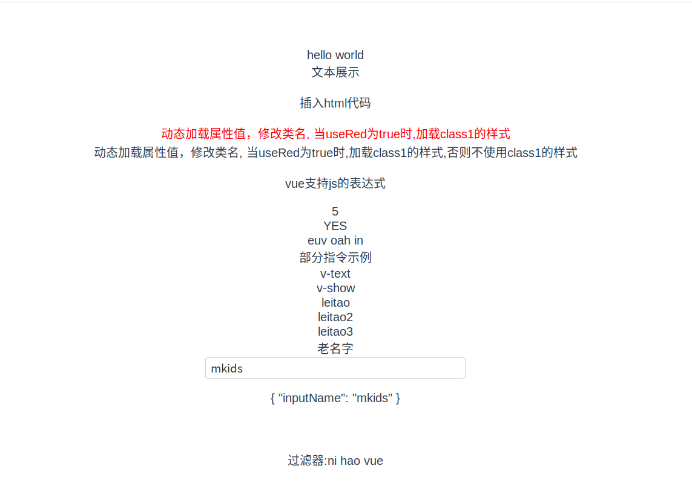

### 4.2.模板语法

​	继续使用之前创建的项目, 以下几个例子都将写在`HelloWorld.vue`中。给大家演示一下vue 常见的语法的使用。

#### 4.2.1.插值

​	在页面中展示得到的数据，可使用一下几种方式,：

##### **展示文本**

​	使用 {{...}}（双大括号）的文本插值

##### **输出html代码**

​	使用 v-html 指令用于输出 html 代码

##### **传递属性值**

​	HTML 属性中的值应使用 v-bind 指令,　在属性中插入变量不用放在{{...}}中，在属性中直接使用

##### **支持表达式**

​	Vue.js 都提供了完全的 JavaScript 表达式支持。

#### 4.2.2.指令

常见的指令, 想了解更多可去官网查阅

指令句式：

```
v-xxx:yyy.zzz="kkk"
xxx:命令名字
yyy:参数
zzz:修饰符
kkk:值
```

| 命令(缩写)                                                   | 作用                                                         | 举例                                                         |
| ------------------------------------------------------------ | ------------------------------------------------------------ | ------------------------------------------------------------ |
| [v-text](https://links.jianshu.com/go?to=https%3A%2F%2Fcn.vuejs.org%2Fv2%2Fapi%2F%23v-text) | 数据绑定标签，将vue对象data中的属性绑定给对应的标签作为内容显示出来，类似js的text属性 | `<div v-text="h1"></div>`                                    |
| [v-html](https://links.jianshu.com/go?to=https%3A%2F%2Fcn.vuejs.org%2Fv2%2Fapi%2F%23v-html) | 类似v-text标签，他是将data的属性作为html语法输出，类似js中的innerHtml属性； | `<div v-html="html_code"></div>`                             |
| [v-show](https://links.jianshu.com/go?to=https%3A%2F%2Fcn.vuejs.org%2Fv2%2Fapi%2F%23v-show) | 根据表达式的真假来切换所绑定的dom的display属性，从而决定是否显示 | `<div v-show="true">v-show Test</div>`                       |
| [v-if](https://links.jianshu.com/go?to=https%3A%2F%2Fcn.vuejs.org%2Fv2%2Fapi%2F%23v-if) | v-if和v-show功能差不多，都是用来控制dom的显隐，用法也一样，只是原理不同，当v-if="false"时，dom被直接删除掉；为true时，又重新渲染此dom；在if中，通常是一个表达式，如 2>1 | `<div id="app">     <div v-if="1>2">1>2t</div>     <div v-else>!1>2</div> </div>` |
| [v-else](https://links.jianshu.com/go?to=https%3A%2F%2Fcn.vuejs.org%2Fv2%2Fapi%2F%23v-else) | v-else用来表示v-if=""的else情况                              |                                                              |
| [v-else-if](https://links.jianshu.com/go?to=https%3A%2F%2Fcn.vuejs.org%2Fv2%2Fapi%2F%23v-else-if) | 用法和v-if 一样                                              |                                                              |
| [v-for](https://links.jianshu.com/go?to=https%3A%2F%2Fcn.vuejs.org%2Fv2%2Fapi%2F%23v-for) | 控制循环                                                     | `<div v-for="list in List">{{list.name}}</div>`              |
| [v-on](https://links.jianshu.com/go?to=https%3A%2F%2Fcn.vuejs.org%2Fv2%2Fapi%2F%23v-on)(@) | 给dom添加一个事件监听, 所有的原生JS事件都支持                | `<div v-on:click="clickButton" v-text="buttonName"></div>`   |
| [v-bind](https://links.jianshu.com/go?to=https%3A%2F%2Fcn.vuejs.org%2Fv2%2Fapi%2F%23v-bind)(:) | 用于将vue的值绑定给对应dom的属性值,如class, id, style等      | `<div v-bind:class="{'class1': useRed}">`                    |
| [v-model](https://links.jianshu.com/go?to=https%3A%2F%2Fcn.vuejs.org%2Fv2%2Fapi%2F%23v-model) | 建立双向数据绑定<br /> **v-model.lazy:**    一般v-model绑定的数据都是实时同步的，加上这个修饰符可以等到change事件再同步另一个的值；<br /> **v-model.number:**    自动将输入的值转为数值类型<br /> **v-model.trim:**    自动trim | `<input v-model="name">`                                     |

##### v-on指令详解

> 语法格式：v-on:js原生事件名.事件修饰符="调用的方法名"

v-on这种写法只是提供了便捷的绑定事件方式，并没有改变原生的JS事件，所以所有的原生JS事件都是支持的  [MDN事件类型一览表](https://developer.mozilla.org/zh-CN/docs/Web/Events)

如最常见的就是click事件：v-on:click="xxx"

绑定多个事件： v-on:="事件名: 调用方法名, 事件名: 调用方法名"

另外，还有一些常见的修饰符：

| *事件修饰符：* | 作用                                               |
| -------------- | -------------------------------------------------- |
| `.stop`        | 阻止事件冒泡                                       |
| `.prevent`     | 提交事件不再重载页面                               |
| `.capture`     | 添加事件侦听器时使用事件捕获模式                   |
| `.self`        | 只当事件在该元素本身（而不是子元素）触发时触发回调 |
| `.once`        | 事件只能点击一次，2.1.4版本新增                    |

#### 4.2.3.过滤器

过滤器，被用作一些常见的文本格式化。由"管道符"指示

格式：　变量 | 过滤方法（在filters中,方法参数为变量）

可以写在大括号中，也可写在指令中

还可以写成：

```
{{ message | filterA | filterB }}
{{ message | filterA('arg1', arg2) }}
```


#### 以上代码示例

代码示例写在HelloWorld中, 代码如下：

```vue
<template xmlns="http://www.w3.org/1999/html">
  <div class="hello">
    hello world <br>
    {{msg}}

    <div v-html="html_code"></div>

    <div v-bind:class="{'class1': useRed}">
      动态加载属性值，修改类名, 当useRed为true时,加载class1的样式
    </div>
    <div v-bind:class="{'class1': notuseRed}">
      动态加载属性值，修改类名, 当useRed为true时,加载class1的样式,否则不使用class1的样式
    </div>

    <p>vue支持js的表达式</p>
    {{1+2*4/2}}<br>
    {{ ok ? 'YES' : 'NO' }}<br>
    {{ tempstr.split('').reverse().join('') }}
    <br>
    <div>部分指令示例</div>
    <div v-text="Vtext"></div>
    <div v-show="true">v-show</div>
    <div v-show="false">v-show</div>
    <div v-for="list in List" v-bind:key="list.age">{{list.name}}</div>
    <div v-on:click="clickButton" v-text="buttonName"></div>
    <input v-model="inputName">
    <p v-text="{inputName}"></p>

    <div id="app">
      过滤器:{{ tempstr | capitalize }}
    </div>
  </div>
</template>

<script>
export default {
  name: 'HelloWorld',
  data () {
    return {
      msg: '文本展示',
      html_code: '<p>插入html代码</p>',
      useRed: true,
      notuseRed: false,
      ok: true,
      tempstr: 'ni hao vue',
      Vtext: 'v-text',
      List: [
        {
          name: 'leitao',
          age: 18
        },
        {
          name: 'leitao2',
          age: 19
        },
        {
          name: 'leitao3',
          age: 20
        }
      ],
      buttonName: '老名字',
      inputName: '输入名字'
    }
  },
  methods: {
    clickButton: function () {
      this.buttonName = '新名字'
    }
  },
  filters: {
    capitalize: function (value) {
      if (!value) return ''
      value = value.toString()
      return value.charAt(0).toUpperCase() + value.slice(1)
    }
  }
}
</script>

<style>
  .class1 {
    color: red;
  }
</style>
```

页面效果：

