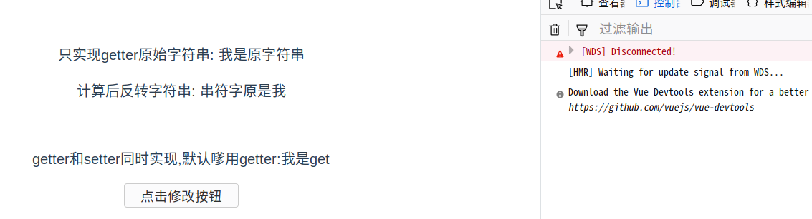
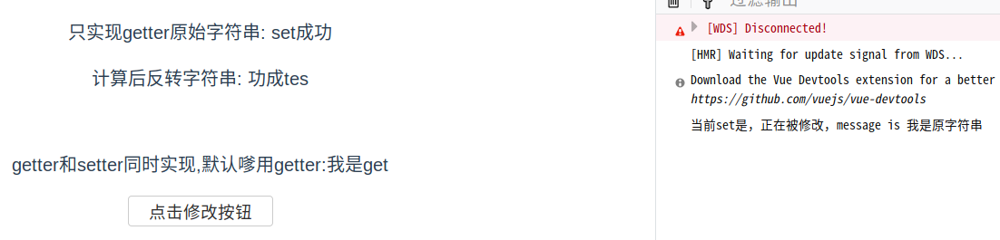

### 4.4.计算属性值

这里的属性并不是指的标签中属性。而是vue实例中data中的属性值。

> ***为什么要计算属性值？***

有时候我们需要让data中的值动态的发生一些改变，对其中的一些值进行一些处理的时候，我们就需要计算属性了。

> **计算属性关键词：computed**

计算属性的方法我们将写在computed中。

示例：

```vue
<template>
  <div>
    <p>原始字符串: {{ message }}</p>
    <p>计算后反转字符串: {{ reversedMessage }}</p>
  </div>
</template>

<script>
export default {
  name: 'ComputedDemo',
  data () {
    return {
      message: '我是原字符串'
    }
  },
  computed: {
    // 计算属性的 getter，只有一个方法的话默认是getter
    reversedMessage: function () {
      // `this` 指向 vm 实例
      return this.message.split('').reverse().join('')
    }
  }
}
</script>
```

> **computed vs methods**:

我们可以使用 methods 来替代 computed，效果上两个都是一样的，但是 computed 是基于它的依赖缓存，只有相关依赖发生改变时才会重新取值。而使用 methods ，在重新渲染的时候，函数总会重新调用执行。 可以说使用 computed 性能会更好，但是如果你不希望缓存，你可以使用 methods 属性。

> **computed setter**

计算属性完成后，还可以将计算完成后的值设置为该属性的当前值，即setter方式。

下面这个例子同时定义了属性的getter和setter：

当属性被修改式，setter就会被触发。示例ComputedDemo.vue：

```vue
<template>
  <div>
    <p>只实现getter原始字符串: {{ message }}</p>
    <p>计算后反转字符串: {{ reversedMessage }}</p>
    <br/>
    <p>getter和setter同时实现,默认调用getter:{{getAndSetDemo}}</p>
    <button @click="setValue()">点击修改按钮</button>
  </div>
</template>

<script>
export default {
  name: 'ComputedDemo',
  data () {
    return {
      message: '我是原字符串'
    }
  },
  computed: {
    // 计算属性的 getter
    reversedMessage: function () {
      // `this` 指向 vm 实例
      return this.message.split('').reverse().join('')
    },
    getAndSetDemo: {
      get: function () {
        return '我是get'
      },
      set: function (newValues) {
        console.log('当前set是，正在被修改，message is ' + this.message)
        this.message = 'set成功'
      }
    }
  },
  methods: {
    setValue: function () {
      // 调用setter方法
      this.getAndSetDemo = 'aa'
    }
  }
}
</script>
```

执行效果：



点击修改后：

