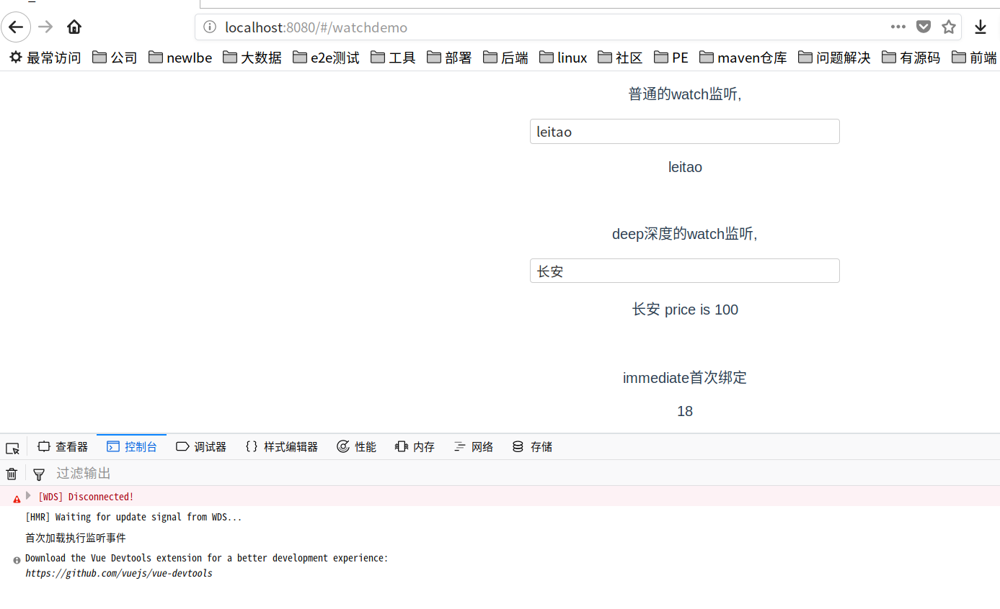
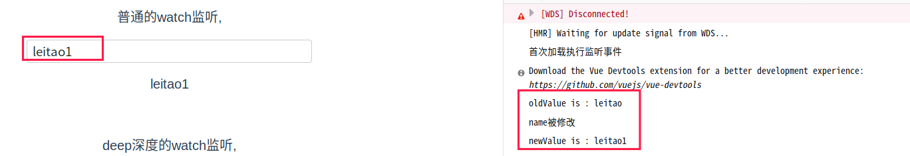
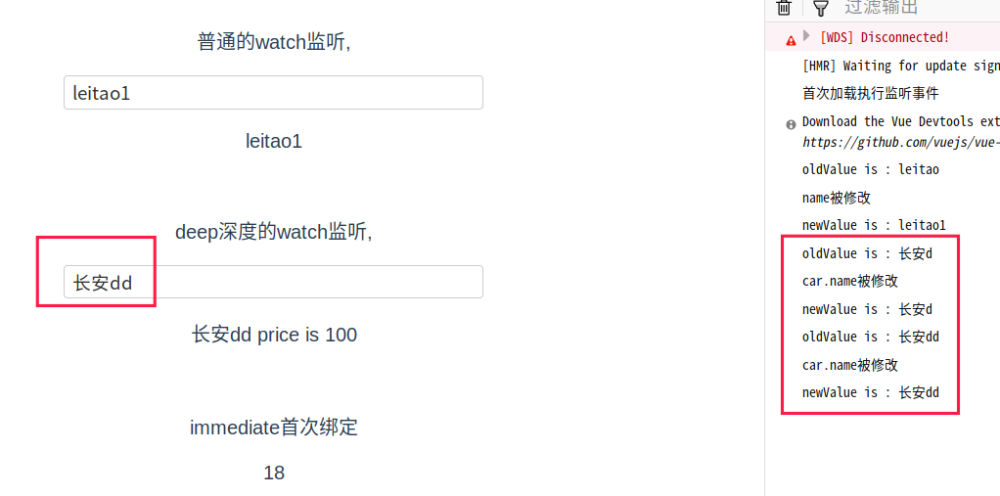

### 4.5.监听属性

> **为什么要监听属性？**

当我们想在某个属性被修改的时候，触发其他的一些操作时，我们就需要用到事件监听

> **监听属性关键字: watch**

> **三个参数：** deep、immediate、handler

| 参数          | 描述                                                         | 默认值 |
| ------------- | ------------------------------------------------------------ | ------ |
| **deep**      | 当需要监听一个对象的改变时，普通的watch方法无法监听到对象内部属性的改变，只有data中的数据才能够监听到变化，此时就需要deep属性对对象进行深度监听 | false  |
| **handler**   | 监听具体的处理方法                                           | -      |
| **immediate** | immediate表示在watch中首次绑定的时候，是否执行handler，值为true则表示在watch中声明的时候，就立即执行handler方法，值为false，则和一般使用watch一样，在数据发生变化的时候才执行handler。大致可以理解为，进入页面的时候就执行一下监听事件 | false  |

> **示例**：在文件WatchDemo.vue中

```vue
<template>
  <div>
    <p>普通的watch监听,</p>
    <input type="text" v-model="name"/>
    <p>{{name}}</p>
    <br/>
    <p>deep深度的watch监听,</p>
    <input type="text" v-model="car.name"/>
    <p>{{car.name}} price is {{car.price}}</p>
    <br/>
    <p>immediate首次绑定</p>
    <p>{{age}}</p>
  </div>
</template>

<script>
export default {
  name: 'WatchDemo',
  data () {
    return {
      name: 'leitao',
      car: {
        name: '长安',
        price: 100
      },
      age: 18
    }
  },
  watch: {
    // 普通的watch监听,watch的其他参数都使用默认值
    name (newValue, oldValue) {
      console.log('oldValue is : ' + oldValue)
      console.log('name被修改')
      console.log('newValue is : ' + newValue)
    },
    car: {
      handler (newValue, oldValue) {
        console.log('oldValue is : ' + oldValue.name)
        console.log('car.name被修改')
        console.log('newValue is : ' + newValue.name)
      },
      deep: true
    },
    age: {
      handler () {
        console.log('首次加载执行监听事件')
      },
      immediate: true
    }
  }
}
</script>
```

执行效果：

在首次打开页面时，可看到控制台打印了 ‘首次加载执行监听事件’：



然后修改第一个输入框的内容：



然后修改第二个输入框内容：




扩展：[computed | watch | methods 的区别](https://www.cnblogs.com/penghuwan/p/7194133.html)