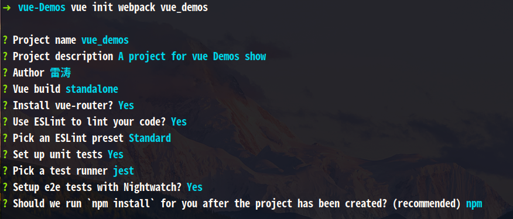
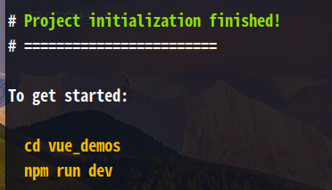
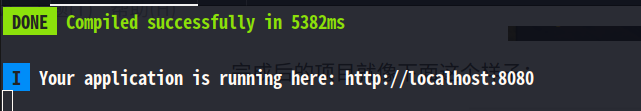
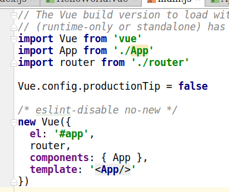
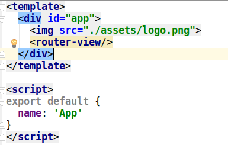
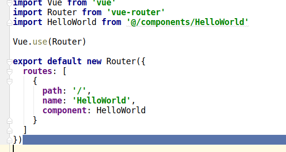
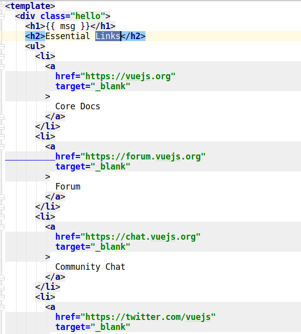
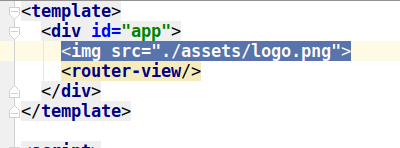
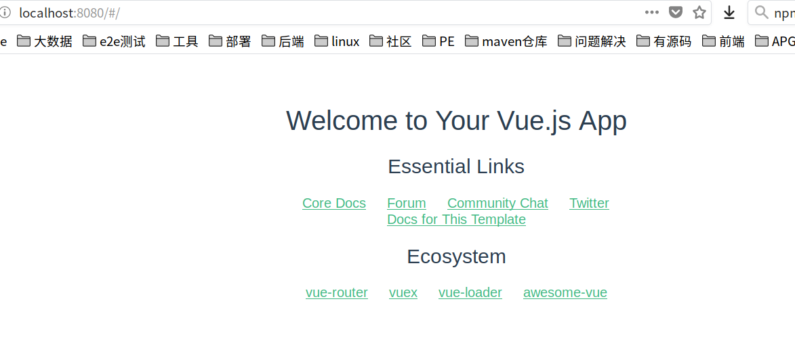
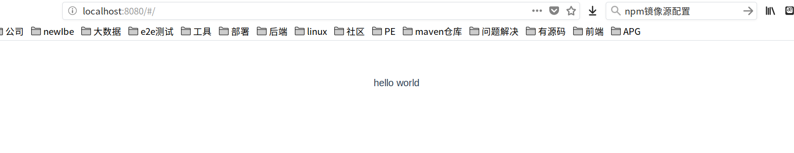

## 3、从Hello World 开始

我们将用一个简单的例子，认识一下vue的项目搭建。该例子就是在页面上显示出简单的一句Hello World。

### 3.1.项目初始化

我们将使用vue脚手架vue-cli工具快速搭建我们的项目。

1. 首先创建一个基于webpack的项目模板

   打开命令行,输入以下命令

   ```
   // vue init webpack 项目名称（注意项目名称不支持大写字母和某些特殊字符）
   $ vue init webpack vue_demos
   ```

   输入上述命令后，会询问你如下信息进行配置，根据提示进行填写和选择即可：

   > **Project name** ：项目名称
   >  **Project description**：项目描述
   >  **Author**：作者
   >  **Vue build**：如何构建项目(上下键选择构建方式)
   >  **Install vue-router**：是否安装路由
   >  **Use ESLint to lint your code**：是否使用ESLint来规范我们的代码
   >  **Pick an ESLint preset**：选择一个ESLint代码规范
   >  **Set up unit tests**：是否需要自动化单元测试
   >  **Setup e2e tests with Nightwatch**：是否需要自动化用户界面测试
   >  **Should we run 'npm install' for your after the project has been created?(recommend)**：在后续安装依赖包是是否使用npm install安装

如图所示：



然后就是等待项目初始化完成，完成后出现以下提示：



完成后的项目就像下面这个样子：


1. 启动项目

   进入项目目录，输入以下命令，即可启动项目：

   ```
   npm run dev
   ```

   然后看到如下内容即项目启动成功，访问其中的url即可：
   

### 3.2.在页面上打印Hello world

   现在我们打开的页面是这样的：

   1. **这个初始化的项目打开为什么它是这个页面呢**？

   我们去查看代码：

   首先查看项目核心入口文件 main.js：

   

   在这个文件中引入根组件文件 *App.vue* 和 *router* 文件夹

   然后，现在来看*App.vue*

   

   可以看出，在app.vue中，引入了一个router-view，也就是引入了一张图片和router中的文件。页面上显示的图片就是``````这句代码产生的。下方的其他内容就是router-view组件中的内容产生的。

   所以进入router目录，查看里面的内容*router/index.vue*：

   

   这个router文件，就是路由文件，用来设置url访问路径对应的页面。从代码中可以看出，```path: '/'```是访问路径，它加载的就是```component: HelloWorld```这个组件。HelloWorld组件从```import HelloWorld from '@/components/HelloWorld'```这句引入的。

   然后，我们打开components/HelloWorld.vue 文件：

   

可以看到这里就是页面中显示的文字和连接。

这就是我们页面上内容的形成原因。

1. **让页面显示HelloWorld**

我们知道了页面形成的原因，那么我们直接修改代码即可。

首先，将App.vue中的图片给删除，删除图中的这句话。不然每个页面都会展示一张图片



删除后页面上就没有那个大图片了



然后，在HelloaWorld.vue中将内容修改为简单的hello world，代码如下：

```vue
<template>
  <div class="hello">
    hello world
  </div>
</template>

<script>
export default {
  name: 'HelloWorld',
  data () {
    return {
      msg: 'Welcome to Your Vue.js App'
    }
  }
}
</script>
```

最后的页面展示效果：



到此，我们就完成了一个简单的页面的展示