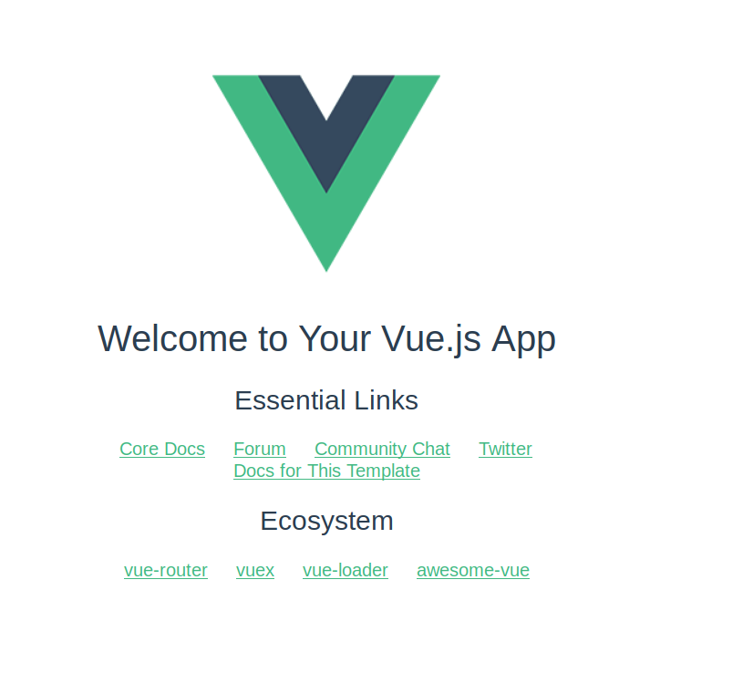

# Vue入门教程

[TOC]


## 1、vue简介

Vue (读音类似于 view) 是一套用于构建用户界面的渐进式框架。与其它大型框架不同的是，Vue 被设计为可以自底向上逐层应用。Vue 的核心库只关注视图层，不仅易于上手，还便于与第三方库或既有项目整合。另一方面，当与现代化的工具链以及各种支持类库结合使用时，Vue 也完全能够为复杂的单页应用提供驱动。


## 2、环境准备以及安装

> 我们将搭建基于webpack脚手架的vue的开发环境。
  其中需要准备安装的工具有：nodejs、webpack、vue、vue-cli

​     

|  工具   |                             简介                             |
| :-----: | :----------------------------------------------------------: |
| nodejs  | 简单的说 Node.js 就是运行在服务端的 JavaScript。其中已经里面包含了npm |
| webpack | 是一个前端资源加载/打包工具，只需要相对简单的配置就可以提供前端工程化需要的各种功能。 |
| vue-cli | Vue.js 提供的一个官方命令行工具，可用于快速搭建大型单页应用。 可以轻松的创建新的应用程序而且可用于自动生成vue和webpack的项目模板。 |


### 2.1.windows系统中安装

- **安装Nodejs**

  **下载**对应的版本：<https://nodejs.org/en/download/>。 或者去中心内网中下载：http://ftp.cqrd.com/software/nodejs

  我这里下载的是Windows Installer (.msi) 64-bit的

  

  根据提示一步步安装下去

  

  安装完成后在cmd命令行输入命令查看时候安装成功, 安装成功则回显示版本号：

  \>node -v

  \>npm -v

  

  **配置镜像源**

  由于npm的默认镜像源下载太慢，可以配置淘宝镜像源，配置命令如下：

  ```
  npm config set registry https://registry.npm.taobao.org
  ```

  或者或者我们中心内网的镜像源：

  ```
  npm config set registry http://nexusproxy.paas.x/repository/npm-group/
  npm config set @cqrd:registry http://172.26.1.6:30527/repository/npm-hosted/
  ```

- **全局安装webpack**
  在cmd命令行中输入：

  ```
  > npm i webpack -g
  > npm i webpack-cli -g
  ```

  没有error报错即安装成功

- **全局安装vue、vue-cli**

  ```
  npm i vue -g
  npm i vue-cli -g
  ```

  安装成功如下图所示：

  

### 2.2.linux系统中安装

- **安装Nodejs**

     1.ubuntu系统可直接使用一个命令安装： 

  ```
  sudo apt-get install nodejs 
  ```

  2. 其他linux系统，可使用源码安装 Node.js

  在官网中下载源码

  

  然后执行一下命令：

  ```
  //解压
  $ tar zxvf node-v12.15.0.tar.gz
  // 修改权限
  $ sudo chmod -R 755 node-v12.15.0
  // 进行编译安装
  $ cd node-v12.15.0 
  $ ./configure --prefix=/usr/local/node/12.15.0
  $ sudo make && make install
  // 如果报错：make[1]: g++：命令未找到
  则需要 sudo apt-get install g++ (软件源自行设置)
  ```

  配置NODE_HOME，进入profile编辑环境变量 

  ```
  vim /etc/profile
  ```

  在这个文件的最后添加：

  ```
  export NODE_HOME=/usr/local/node/12.15.0
  export PATH=$NODE_HOME/bin:$PATH
  ```

  重启后生效。

  查看是否安装成功：

  ```
  $ node -v
  $ npm -v
  ```

  显示版本号即安装成功

  后面的npm镜像源设置，webpack、vue、vue-cli安装方式同上

### 2.3.项目初始化目录结构


| 目录/文件    | 说明                                                         |
| ------------ | ------------------------------------------------------------ |
| build        | 项目构建(webpack)相关代码                                    |
| config       | 配置目录，包括端口号等。我们初学可以使用默认的。             |
| node_modules | npm 加载的项目依赖模块                                       |
| src          | 这里是我们要开发的目录，基本上要做的事情都在这个目录里。里面包含了几个目录及文件：       **assets**: 放置一些图片，如logo等。     **components**: 目录里面放了一个组件文件，可以不用。   **App.vue**:  根组件，我们也可以直接将组件写这里，而不使用 components 目录。    **main.js**: 项目入口文件，核心文件。 |
| static       | 静态资源目录，如图片、字体等。                               |
| test         | 初始测试目录，可删除                                         |
| .xxxx文件    | 这些是一些配置文件，包括语法配置，git配置等。                |
| index.html   | 首页入口文件，你可以添加一些 meta 信息或统计代码啥的。       |
| package.json | 项目配置文件。                                               |
| README.md    | 项目的说明文档，markdown 格式                                |


### 2.4.推荐开发工具

​	推荐使用webstorm，也是属于IDE系列的产品，适用于用过Intellij idea的程序员。其他的使用vscode也可以，按照自己的开发习惯选择


## 3、从Hello World 开始

我们将用一个简单的例子，认识一下vue的项目搭建。该例子就是在页面上显示出简单的一句Hello World。

### 3.1.项目初始化

我们将使用vue脚手架vue-cli工具快速搭建我们的项目。

1. 首先创建一个基于webpack的项目模板

   打开命令行,输入以下命令

   ```
   // vue init webpack 项目名称（注意项目名称不支持大写字母和某些特殊字符）
   $ vue init webpack vue_demos
   ```

   输入上述命令后，会询问你如下信息进行配置，根据提示进行填写和选择即可：

   > **Project name** ：项目名称
   >  **Project description**：项目描述
   >  **Author**：作者
   >  **Vue build**：如何构建项目(上下键选择构建方式)
   >  **Install vue-router**：是否安装路由
   >  **Use ESLint to lint your code**：是否使用ESLint来规范我们的代码
   >  **Pick an ESLint preset**：选择一个ESLint代码规范
   >  **Set up unit tests**：是否需要自动化单元测试
   >  **Setup e2e tests with Nightwatch**：是否需要自动化用户界面测试
   >  **Should we run 'npm install' for your after the project has been created?(recommend)**：在后续安装依赖包是是否使用npm install安装

如图所示：


然后就是等待项目初始化完成，完成后出现以下提示：


完成后的项目就像下面这个样子：


2. 启动项目

   进入项目目录，输入以下命令，即可启动项目：

   ```
   npm run dev
   ```

   然后看到如下内容即项目启动成功，访问其中的url即可：
   

### 3.2.在页面上打印Hello world

   现在我们打开的页面是这样的：

   1. **这个初始化的项目打开为什么它是这个页面呢**？

   我们去查看代码：

   首先查看项目核心入口文件 main.js：

   

   在这个文件中引入根组件文件 *App.vue* 和 *router* 文件夹

   然后，现在来看*App.vue*

   

   可以看出，在app.vue中，引入了一个router-view，也就是引入了一张图片和router中的文件。页面上显示的图片就是``````这句代码产生的。下方的其他内容就是router-view组件中的内容产生的。

   所以进入router目录，查看里面的内容*router/index.vue*：

   

   这个router文件，就是路由文件，用来设置url访问路径对应的页面。从代码中可以看出，```path: '/'```是访问路径，它加载的就是```component: HelloWorld```这个组件。HelloWorld组件从```import HelloWorld from '@/components/HelloWorld'```这句引入的。

   然后，我们打开components/HelloWorld.vue 文件：

   

可以看到这里就是页面中显示的文字和连接。

这就是我们页面上内容的形成原因。

2. **让页面显示HelloWorld**

我们知道了页面形成的原因，那么我们直接修改代码即可。

首先，将App.vue中的图片给删除，删除图中的这句话。不然每个页面都会展示一张图片


删除后页面上就没有那个大图片了


然后，在HelloaWorld.vue中将内容修改为简单的hello world，代码如下：

```vue
<template>
  <div class="hello">
    hello world
  </div>
</template>

<script>
export default {
  name: 'HelloWorld',
  data () {
    return {
      msg: 'Welcome to Your Vue.js App'
    }
  }
}
</script>
```

最后的页面展示效果：


到此，我们就完成了一个简单的页面的展示


## 4、基本语法

### 4.1.	vue的一些“术语”

​	在学习vue之前，要知道一些常用在前端开发和vue开发中的一些常用"术语"。从而对前端vue开发有个大致的印象，以及在后面的学习中对一些描述的语句更容易理解。

​	

| 术语   | 介绍                                                         |
| ------ | ------------------------------------------------------------ |
| 组件   | 可以理解成机器的某种零件，小零件可以组装成大零件。最后各个大小的零件组成一个完整的物体。熟悉java的同学，也可以理解成一个类，他可以产生很多对象用在其他地方 |
| 指令   | 在vue中提供了一些对于页面 + 数据的更为方便的输出,这些操作就叫做指令, 以v-xxx表示。 类似于html页面中的属性 `<div v-xxx ></div>`。 指令中封装了一些DOM行为, 结合属性作为一个暗号, 暗号有对应的值,根据不同的值，框架会进行相关DOM操作的绑定 |
| 事件   | 事件是js中常见的名词，类似于java中的方法， 比如说，当用户单击按钮或者提交表单数据时，就发生一个鼠标单击（onclick）事件，需要浏览器做出处理，返回给用户一个结果。 |
| 属性   | 属性存在于html的标签中，用来描述和定义标签的一些信息。如: `<div　属性名＝"属性值"></div>` |
| 路由   | 路由就是我们访问的url。我们可以通过不同的url让我们访问不同的页面 |
| 表单   | 页面上用于输入或选择一些内容的东西                           |
| 关键字 | 在vue实例中，用来定义一些vue的行为模块                       |

#### 4.1.1.常见的关键字

这里的关键字指的是如下代码中所示的,name,data,computed等就是关键字：

```
<template>
  <div>
   xxx
  </div>
</template>

<script>
export default {
  name: 'ComputedDemo',
  data () {
    return {
    }
  },
  computed: {
  },
  methods: {
  }
}
</script>
```

| 关键字     | 简单描述                                                     |
| ---------- | ------------------------------------------------------------ |
| name       | 组件名字                                                     |
| data       | 包含组件属性（类似于组件的全局变量）。它有两种写法：<br />1. data: { xxx: xxx}<br/>2. data () { return { xxx: xxx} } |
| methods    | 用来包含组件中调用的事件                                     |
| computed   | 用于计算属性，和data里的属性是同一类                         |
| watch      | 用于监听属性                                                 |
| filters    | 过滤器                                                       |
| components | 引入外部组件                                                 |
| props      | 是子组件用来接受父组件传递过来的数据的一个自定义属性         |
| created    | html加载完成之前，执行。执行顺序：父组件-子组件              |
| mounted    | html加载完成后执行。执行顺序：子组件-父组件                  |


### 4.2.模板语法

​	继续使用之前创建的项目, 以下几个例子都将写在`HelloWorld.vue`中。给大家演示一下vue 常见的语法的使用。

#### 4.2.1.插值

​	在页面中展示得到的数据，可使用一下几种方式,：

##### **展示文本**

​	使用 {{...}}（双大括号）的文本插值

##### **输出html代码**

​	使用 v-html 指令用于输出 html 代码

##### **传递属性值**

​	HTML 属性中的值应使用 v-bind 指令,　在属性中插入变量不用放在{{...}}中，在属性中直接使用

##### **支持表达式**

​	Vue.js 都提供了完全的 JavaScript 表达式支持。

#### 4.2.2.指令

常见的指令, 想了解更多可去官网查阅

指令句式：

```
v-xxx:yyy.zzz="kkk"
xxx:命令名字
yyy:参数
zzz:修饰符
kkk:值
```

| 命令(缩写)                                                   | 作用                                                         | 举例                                                         |
| ------------------------------------------------------------ | ------------------------------------------------------------ | ------------------------------------------------------------ |
| [v-text](https://links.jianshu.com/go?to=https%3A%2F%2Fcn.vuejs.org%2Fv2%2Fapi%2F%23v-text) | 数据绑定标签，将vue对象data中的属性绑定给对应的标签作为内容显示出来，类似js的text属性 | `<div v-text="h1"></div>`                                    |
| [v-html](https://links.jianshu.com/go?to=https%3A%2F%2Fcn.vuejs.org%2Fv2%2Fapi%2F%23v-html) | 类似v-text标签，他是将data的属性作为html语法输出，类似js中的innerHtml属性； | `<div v-html="html_code"></div>`                             |
| [v-show](https://links.jianshu.com/go?to=https%3A%2F%2Fcn.vuejs.org%2Fv2%2Fapi%2F%23v-show) | 根据表达式的真假来切换所绑定的dom的display属性，从而决定是否显示 | `<div v-show="true">v-show Test</div>`                       |
| [v-if](https://links.jianshu.com/go?to=https%3A%2F%2Fcn.vuejs.org%2Fv2%2Fapi%2F%23v-if) | v-if和v-show功能差不多，都是用来控制dom的显隐，用法也一样，只是原理不同，当v-if="false"时，dom被直接删除掉；为true时，又重新渲染此dom；在if中，通常是一个表达式，如 2>1 | `<div id="app">     <div v-if="1>2">1>2t</div>     <div v-else>!1>2</div> </div>` |
| [v-else](https://links.jianshu.com/go?to=https%3A%2F%2Fcn.vuejs.org%2Fv2%2Fapi%2F%23v-else) | v-else用来表示v-if=""的else情况                              |                                                              |
| [v-else-if](https://links.jianshu.com/go?to=https%3A%2F%2Fcn.vuejs.org%2Fv2%2Fapi%2F%23v-else-if) | 用法和v-if 一样                                              |                                                              |
| [v-for](https://links.jianshu.com/go?to=https%3A%2F%2Fcn.vuejs.org%2Fv2%2Fapi%2F%23v-for) | 控制循环                                                     | `<div v-for="list in List">{{list.name}}</div>`              |
| [v-on](https://links.jianshu.com/go?to=https%3A%2F%2Fcn.vuejs.org%2Fv2%2Fapi%2F%23v-on)(@) | 给dom添加一个事件监听, 所有的原生JS事件都支持                | `<div v-on:click="clickButton" v-text="buttonName"></div>`   |
| [v-bind](https://links.jianshu.com/go?to=https%3A%2F%2Fcn.vuejs.org%2Fv2%2Fapi%2F%23v-bind)(:) | 用于将vue的值绑定给对应dom的属性值,如class, id, style等      | `<div v-bind:class="{'class1': useRed}">`                    |
| [v-model](https://links.jianshu.com/go?to=https%3A%2F%2Fcn.vuejs.org%2Fv2%2Fapi%2F%23v-model) | 建立双向数据绑定<br /> **v-model.lazy:**    一般v-model绑定的数据都是实时同步的，加上这个修饰符可以等到change事件再同步另一个的值；<br /> **v-model.number:**    自动将输入的值转为数值类型<br /> **v-model.trim:**    自动trim | `<input v-model="name">`                                     |

##### v-on指令详解

> 语法格式：v-on:js原生事件名.事件修饰符="调用的方法名"

v-on这种写法只是提供了便捷的绑定事件方式，并没有改变原生的JS事件，所以所有的原生JS事件都是支持的  [MDN事件类型一览表](https://developer.mozilla.org/zh-CN/docs/Web/Events)

如最常见的就是click事件：v-on:click="xxx"

绑定多个事件： v-on:="事件名: 调用方法名, 事件名: 调用方法名"

另外，还有一些常见的修饰符：

| *事件修饰符：* | 作用                                               |
| -------------- | -------------------------------------------------- |
| `.stop`        | 阻止事件冒泡                                       |
| `.prevent`     | 提交事件不再重载页面                               |
| `.capture`     | 添加事件侦听器时使用事件捕获模式                   |
| `.self`        | 只当事件在该元素本身（而不是子元素）触发时触发回调 |
| `.once`        | 事件只能点击一次，2.1.4版本新增                    |

#### 4.2.3.过滤器

过滤器，被用作一些常见的文本格式化。由"管道符"指示

格式：　变量 | 过滤方法（在filters中,方法参数为变量）

可以写在大括号中，也可写在指令中

还可以写成：

```
{{ message | filterA | filterB }}
{{ message | filterA('arg1', arg2) }}
```


#### 以上代码示例

代码示例写在HelloWorld中, 代码如下：

```vue
<template xmlns="http://www.w3.org/1999/html">
  <div class="hello">
    hello world <br>
    {{msg}}

    <div v-html="html_code"></div>

    <div v-bind:class="{'class1': useRed}">
      动态加载属性值，修改类名, 当useRed为true时,加载class1的样式
    </div>
    <div v-bind:class="{'class1': notuseRed}">
      动态加载属性值，修改类名, 当useRed为true时,加载class1的样式,否则不使用class1的样式
    </div>

    <p>vue支持js的表达式</p>
    {{1+2*4/2}}<br>
    {{ ok ? 'YES' : 'NO' }}<br>
    {{ tempstr.split('').reverse().join('') }}
    <br>
    <div>部分指令示例</div>
    <div v-text="Vtext"></div>
    <div v-show="true">v-show</div>
    <div v-show="false">v-show</div>
    <div v-for="list in List" v-bind:key="list.age">{{list.name}}</div>
    <div v-on:click="clickButton" v-text="buttonName"></div>
    <input v-model="inputName">
    <p v-text="{inputName}"></p>

    <div id="app">
      过滤器:{{ tempstr | capitalize }}
    </div>
  </div>
</template>

<script>
export default {
  name: 'HelloWorld',
  data () {
    return {
      msg: '文本展示',
      html_code: '<p>插入html代码</p>',
      useRed: true,
      notuseRed: false,
      ok: true,
      tempstr: 'ni hao vue',
      Vtext: 'v-text',
      List: [
        {
          name: 'leitao',
          age: 18
        },
        {
          name: 'leitao2',
          age: 19
        },
        {
          name: 'leitao3',
          age: 20
        }
      ],
      buttonName: '老名字',
      inputName: '输入名字'
    }
  },
  methods: {
    clickButton: function () {
      this.buttonName = '新名字'
    }
  },
  filters: {
    capitalize: function (value) {
      if (!value) return ''
      value = value.toString()
      return value.charAt(0).toUpperCase() + value.slice(1)
    }
  }
}
</script>

<style>
  .class1 {
    color: red;
  }
</style>
```

页面效果：


### 4.3.判断和循环

#### 4.3.1.条件判断

总共就几个命令: v-if | v-else-if | v-else | v-show

其使用逻辑和普通的　if , else if, else　使用是一样的。在其中写入条件表达式 

v-show 和v-if不一样的是, if判断不通过时，页面不回加载其包含的DOM元素，而v-show会加载DOM元素，只是它的属性变成了disable

#### 4.3.2.循环

语法格式：`v-for="item in lists"`  

说明：

> - lists：表示要遍历的数组
> - item：表示数组中的某个元素, 元素也可以是一个json对象
> - 可以用来遍历数组，也可以用来遍历对象
> - 有点类似java的 for(Object a : List )
> - v-for会循环展示该for标签包含的内容。
> - 注意在使用for遍历时，要加上key值，否则控制台会报错

```
<div v-for="list in List" v-bind:key="list.age">{{list.name}}</div>
```

运行结果：

leitao

leitao2

leitao3

- 也可以这样使用：

```
// 遍历数组，index 可选参数，表示索引。value和key可以命名成其他名字
<div v-for="(value,key,index) in List">{{index}}.{{key}}:{{value}}</div>
// value,key和index可以命名成其他名字，可以写成这样
<div v-for="(v,k, i) in List" v-bind:key="i">{{i}}.{{k}}:{{v}}</div>
```

运行结果：

.0:{   "name": "leitao",   "age": 18 }

.1:{   "name": "leitao2",   "age": 19 }

.2:{   "name": "leitao3",   "age": 20 }

```
// 遍历某个对象时
<div v-for="(value,key, i) in tempObj" v-bind:key="i">{{i}}.{{key}}:{{value}}</div>
```

运行结果：

0.name:laolei

1.height:180

2.from:ChongQing

### 4.4.计算属性值

这里的属性并不是指的标签中属性。而是vue实例中data中的属性值。

> ***为什么要计算属性值？***

有时候我们需要让data中的值动态的发生一些改变，对其中的一些值进行一些处理的时候，我们就需要计算属性了。

> **计算属性关键词：computed**

计算属性的方法我们将写在computed中。

示例：

```vue
<template>
  <div>
    <p>原始字符串: {{ message }}</p>
    <p>计算后反转字符串: {{ reversedMessage }}</p>
  </div>
</template>

<script>
export default {
  name: 'ComputedDemo',
  data () {
    return {
      message: '我是原字符串'
    }
  },
  computed: {
    // 计算属性的 getter，只有一个方法的话默认是getter
    reversedMessage: function () {
      // `this` 指向 vm 实例
      return this.message.split('').reverse().join('')
    }
  }
}
</script>
```

> **computed vs methods**:

我们可以使用 methods 来替代 computed，效果上两个都是一样的，但是 computed 是基于它的依赖缓存，只有相关依赖发生改变时才会重新取值。而使用 methods ，在重新渲染的时候，函数总会重新调用执行。 可以说使用 computed 性能会更好，但是如果你不希望缓存，你可以使用 methods 属性。

> **computed setter**

计算属性完成后，还可以将计算完成后的值设置为该属性的当前值，即setter方式。

下面这个例子同时定义了属性的getter和setter：

当属性被修改式，setter就会被触发。示例ComputedDemo.vue：

```vue
<template>
  <div>
    <p>只实现getter原始字符串: {{ message }}</p>
    <p>计算后反转字符串: {{ reversedMessage }}</p>
    <br/>
    <p>getter和setter同时实现,默认调用getter:{{getAndSetDemo}}</p>
    <button @click="setValue()">点击修改按钮</button>
  </div>
</template>

<script>
export default {
  name: 'ComputedDemo',
  data () {
    return {
      message: '我是原字符串'
    }
  },
  computed: {
    // 计算属性的 getter
    reversedMessage: function () {
      // `this` 指向 vm 实例
      return this.message.split('').reverse().join('')
    },
    getAndSetDemo: {
      get: function () {
        return '我是get'
      },
      set: function (newValues) {
        console.log('当前set是，正在被修改，message is ' + this.message)
        this.message = 'set成功'
      }
    }
  },
  methods: {
    setValue: function () {
      // 调用setter方法
      this.getAndSetDemo = 'aa'
    }
  }
}
</script>
```

执行效果：


点击修改后：


### 4.5.监听属性

> **为什么要监听属性？**

当我们想在某个属性被修改的时候，触发其他的一些操作时，我们就需要用到事件监听

> **监听属性关键字: watch**

> **三个参数：** deep、immediate、handler

| 参数          | 描述                                                         | 默认值 |
| ------------- | ------------------------------------------------------------ | ------ |
| **deep**      | 当需要监听一个对象的改变时，普通的watch方法无法监听到对象内部属性的改变，只有data中的数据才能够监听到变化，此时就需要deep属性对对象进行深度监听 | false  |
| **handler**   | 监听具体的处理方法                                           | -      |
| **immediate** | immediate表示在watch中首次绑定的时候，是否执行handler，值为true则表示在watch中声明的时候，就立即执行handler方法，值为false，则和一般使用watch一样，在数据发生变化的时候才执行handler。大致可以理解为，进入页面的时候就执行一下监听事件 | false  |

> **示例**：在文件WatchDemo.vue中

```vue
<template>
  <div>
    <p>普通的watch监听,</p>
    <input type="text" v-model="name"/>
    <p>{{name}}</p>
    <br/>
    <p>deep深度的watch监听,</p>
    <input type="text" v-model="car.name"/>
    <p>{{car.name}} price is {{car.price}}</p>
    <br/>
    <p>immediate首次绑定</p>
    <p>{{age}}</p>
  </div>
</template>

<script>
export default {
  name: 'WatchDemo',
  data () {
    return {
      name: 'leitao',
      car: {
        name: '长安',
        price: 100
      },
      age: 18
    }
  },
  watch: {
    // 普通的watch监听,watch的其他参数都使用默认值
    name (newValue, oldValue) {
      console.log('oldValue is : ' + oldValue)
      console.log('name被修改')
      console.log('newValue is : ' + newValue)
    },
    car: {
      handler (newValue, oldValue) {
        console.log('oldValue is : ' + oldValue.name)
        console.log('car.name被修改')
        console.log('newValue is : ' + newValue.name)
      },
      deep: true
    },
    age: {
      handler () {
        console.log('首次加载执行监听事件')
      },
      immediate: true
    }
  }
}
</script>
```

执行效果：

在首次打开页面时，可看到控制台打印了 ‘首次加载执行监听事件’：


然后修改第一个输入框的内容：


然后修改第二个输入框内容：


扩展：[computed | watch | methods 的区别](https://www.cnblogs.com/penghuwan/p/7194133.html)


### 4.6.怎么绑定样式

在html中设置元素样式使用一般class和style属性。

- 我们使用v-bind指令来设置样式

```
<div v-bind:class="{ active: isActive }"></div>
```

上面这个代码表示，当isActive为true时，就设置样式为active的样式。

- 同时我们也可以绑定多个样式：

```
<div class="static"
     v-bind:class="{ active: isActive, 'text-danger': hasError }">
</div>
```

这个div绑定了static  active  text-danger三个类的样式。

- 我们也可以使用数组绑定多个样式

  ```
  <div v-bind:class="[activeClass, errorClass]"></div>
  ```

- 可以使用三元表达式来切换列表中的 class ：

  ```
  <div v-bind:class="[errorClass ,isActive ? activeClass : '']"></div>
  ```

- 设置内联样式

  ```
  div id="app">
      <div v-bind:style="{ color: activeColor, fontSize: fontSize + 'px' }">菜鸟教程</div>
  </div>
  ```

#### 4.6.1.怎么引入外部.scss、.less、.js等样式文件

  1.引入js

  ```js
  <script>
      import xxx from '相对路径js文件.js'
  </script>
  ```

  2.引入scss less css等样式文件

  在sytle中引入

  ```
  // 引入css
  <style scoped>
  	@import	"相对路径.css"
  </style>
  
  // 引入scss
  <style lang="scss" scoped>
  	@import	"相对路径.scss"
  </style>
  ```

### 4.7.表单

  使用v-model进行数据双向绑定

1. 输入框

   ```
   <input v-model="message" />
   <textarea v-model="message2" placeholder="多行文本输入……"></textarea>
   ```

2. 单选按钮

   ```
     <input type="radio" id="runoob" value="Runoob" v-model="picked">
     <label for="runoob">Runoob</label>
     <br>
     <input type="radio" id="google" value="Google" v-model="picked">
     <label for="google">Google</label>
   ```

   

3. 复选框

   ```
     <p>单个复选框：</p>
     <input type="checkbox" id="checkbox" v-model="checked">
     <label for="checkbox">{{ checked }}</label>
       
     <p>多个复选框：</p>
     <input type="checkbox" id="runoob" value="Runoob" v-model="checkedNames">
     <label for="runoob">Runoob</label>
     <input type="checkbox" id="google" value="Google" v-model="checkedNames">
     <label for="google">Google</label>
     <input type="checkbox" id="taobao" value="Taobao" v-model="checkedNames">
     <label for="taobao">taobao</label>
   ```

   每个复选框由一个input和一个label组成。

   input中包含了v-model，value为该复选框的值

   label中的for 指向其对应的input的id。label标签内容为所展示的内容

   注意：1. input的类型要是checkbox

   ​            2.多个复选框的id不能相同

4. 下拉列表

   ```
   <select v-model="selected" name="fruit">
       <option value="">选择一个网站</option>
       <option value="www.runoob.com">Runoob</option>
       <option value="www.google.com">Google</option>
   </select>
   ```

   使用select标签，option标签为每个下拉选项

## 5、组件（核心）

组件（Component）是 Vue.js 最强大的功能之一。

组件可以扩展 HTML 元素，封装可重用的代码。

组件系统让我们可以用独立可复用的小组件来构建大型应用

我们将以HelloWorld的项目为例，讲解组件的简单用法。

### 5.1.创建组件

在项目中的components目录下新建一个.vue的文件。这里我在项目中新建了个ShowButton.vue的文件


然后，写入初始化的必要代码(你可以将其写成模板，下次直接使用)：

```vue
<template>
  <div id="ShowButton">
  </div>
</template>

<script>
export default {
  name: 'ShowButton',
  data () {
    return {

    }
  }
}
</script>

```

在<template>中：写要展示的html内容,里面最好再用一个标签将其要展示的内容包起来

name是你的组件名字，建议和文件名保持一致

data要写成函数形式，在里面的return中，添加你需要的数据属性。

这是这个组件最终的内容：

```vue
<template>
  <div id="ShowButton">
    <button @click="myclick">我要改变</button>
    <br/>
    <p>{{message}}</p>
  </div>
</template>

<script>
export default {
  name: 'ShowButton',
  data () {
    return {
      message: '原来的我'
    }
  },
  methods: {
    myclick: function () {
      this.message = '现在的我'
    }
  }
}
</script>
```

### 5.2.引入组件

在<script>的第一行，加入import语句，引入ShowButton组件

然后在vue中的components中，添加此组件

我们将组件引入另一个组件WatchDemo.vue中：

```
// 大致代码如下
<template>
  <div>
    <ShowButton/>
  </div>
</template>

<script>
import ShowButton from './ShowButton'
export default {
  name: 'WatchDemo',
  components: {
    ShowButton
  }
}
</script>
```

具体代码如下：

```vue
<template>
  <div>
    <p>普通的watch监听,</p>
    <input type="text" v-model="name"/>
    <p>{{name}}</p>
    <br/>
    <p>deep深度的watch监听,</p>
    <input type="text" v-model="car.name"/>
    <p>{{car.name}} price is {{car.price}}</p>
    <br/>
    <p>immediate首次绑定</p>
    <p>{{age}}</p>

    <br/>
    <ShowButton/>
  </div>
</template>

<script>
import ShowButton from './ShowButton'
export default {
  name: 'WatchDemo',
  components: {
    ShowButton
  },
  data () {
    return {
      name: 'leitao',
      car: {
        name: '长安',
        price: 100
      },
      age: 18
    }
  },
  watch: {
    // 普通的watch监听,watch的其他参数都使用默认值
    name (newValue, oldValue) {
      console.log('oldValue is : ' + oldValue)
      console.log('name被修改')
      console.log('newValue is : ' + newValue)
    },
    car: {
      handler (newValue, oldValue) {
        console.log('oldValue is : ' + oldValue.name)
        console.log('car.name被修改')
        console.log('newValue is : ' + newValue.name)
      },
      deep: true
    },
    age: {
      handler () {
        console.log('首次加载执行监听事件')
      },
      immediate: true
    }
  }
}
</script>
```

运行结果，可以看见在这个页面中已经引入ShowButton的组件了：


### 5.3.组件数据传递

>  **父组件值传递给子组件需要使用 =>props。**

我们上面例子中的ShowButton组件被引入到了WatchDemo组件中，则WatchDemo就是父组件，ShowButton就是子组件，我们将name作为数据传递到子组件中。

**子组件怎么接收数据**

在子组件(ShowButton)中，使用props关键字,以数组的形式添加父组件参数：

```
props:['fatherName']
```

具体代码ShowButton.vue:

```vue
<template>
  <div id="ShowButton">
    <button @click="myclick">我要改变</button>
    <br/>
    <p>{{message}}</p>
    <p>父子组件的遗产:{{fatherName}}</p>
  </div>
</template>

<script>
export default {
  name: 'ShowButton',
  data () {
    return {
      message: '原来的我'
    }
  },
  methods: {
    myclick: function () {
      this.message = '现在的我'
    }
  },
  props: ['fatherName']
}
</script>
```

**父组件怎么传递数据**

在父组件中，在调用子组件的标签中添加属性名,属性名要和子组件中props中的名字一样。形如：

```
// 双引号中的内容将作为实际的值传递，如这里传递到子组件的值就是 name
<ShowButton fatherName="name" />
// 在属性名前面加个冒号，则后面双引号的值表示name对应的data中的属性，它的值就是leitao
<ShowButton :fatherName="name" />
```

运行效果：


> **子组件 -->传值到父组件:$emit**

在子组件中添加一个点击事件，用来传递值给父组件：

```
<p>贡献给父亲:</p>
<input type="button" @click="sendMsg" value="子组件值传父组件">
```

在方法区中添加点击事件，使用$emit方法传递参数：

```
sendMsg: function () {
  this.$emit('childMsg', '子组件值')
}
//  childMsg在父组件作为事件名称
```

在父组件中：

```
// @childMsg为子组件$emit中定义的名字。childEvent为父组件自己事件名
<ShowButton fatherName="name" @childMsg = "childEvent"/>
```

父组件添加方法：

```
methods: {
  childEvent: function (childValue) {
    console.log('子组件的值: ' + childValue)
  }
}
```

运行效果，点击按钮后，控制台输出日志：


>  **Prop 验证**

组件可以为 props 指定验证要求。

为了定制 prop 的验证方式，你可以为 props 中的值提供一个带有验证需求的对象，而不是一个字符串数组。例如：

```
props: {
    // 基础的类型检查 (`null` 和 `undefined` 会通过任何类型验证)
    propA: Number,
    // 多个可能的类型
    propB: [String, Number],
    // 必填的字符串
    propC: {
      type: String,
      required: true
    },
    // 带有默认值的数字
    propD: {
      type: Number,
      default: 100
    },
    // 带有默认值的对象
    propE: {
      type: Object,
      // 对象或数组默认值必须从一个工厂函数获取
      default: function () {
        return { message: 'hello' }
      }
    },
    // 自定义验证函数
    propF: {
      validator: function (value) {
        // 这个值必须匹配下列字符串中的一个
        return ['success', 'warning', 'danger'].indexOf(value) !== -1
      }
    }
  }
```

## 6、路由

 路由需要载入 [vue-router 库](https://github.com/vuejs/vue-router)

中文文档地址：[vue-router文档](http://router.vuejs.org/zh-cn/)。

在我们的项目中，使用vue-cli初始化项目的时候，已经载入vue-router。

1.使用路由页面跳转：

**使用<router-link>**

```
<!-- 使用 router-link 组件来导航. -->
<!-- 通过传入 `to` 属性指定链接. -->
<!-- <router-link> 默认会被渲染成一个 `<a>` 标签 -->
<router-link to="/watchdemo">跳转到watchdemo</router-link>
```

2.动态路由分配

在本项目中，路由的分配都在router/index.js中定义。代码示例如下：

```js
import Vue from 'vue'
import Router from 'vue-router'
import HelloWorld from '@/components/HelloWorld'
import ComputedDemo from '@/components/ComputedDemo'
import WatchDemo from '@/components/WatchDemo'
import VOnDemo from '@/components/VOnDemo' // 引入相关组件

// 导入 Vue 和 VueRouter，
Vue.use(Router)

export default new Router({
  routes: [
    {
      path: '/', // 访问路径
      name: 'HelloWorld', // 可选项，路由名字
      component: HelloWorld  // 组件名字
    },
    {
      path: '/computeddemo',
      name: 'ComputedDemo',
      component: ComputedDemo
    },
    {
      path: '/watchdemo',
      name: 'WatchDemo',
      component: WatchDemo
    },
    {
      path: '/vondemo',
      name: 'VOnDemo',
      component: VOnDemo
    }
  ]
})
```


## 7、webpack的简单操作

webpack是一个前端的模块化打包(构建)的工具

它的特点是：webpack将一切繁杂的、重复的、机械的工作自动处理，开发者只需要关注于功能的实现的。

这一节只简单讲解一下怎么使用webpack打包。

### 7.1.打包（构建）做了哪些事：

- 1.语法转换

​    ES6--->ES5   供浏览器的解析

​    less/sass---->css   供浏览器的解析

​    TS------> ES5  供浏览器的解析

- 2.文件压缩和合并

  js / html /css 文件压缩，删除所有的注释和空格，变量名简写

  js / css 文件合并 ，将多个js文件或则css文件合并成一个js文件或则css文件

- 3.提供开发期间的服务器

  能够自动打开浏览器，监听文件变化，自动刷新浏览器的

 配置文件

 ### 7.2.配置文件

由于我们是用vue-cli快速创建的项目，很多配置文件都弄好了的。

主要配置文件有package.json 和 config文件夹下的文件，以及build文件夹下的文件

 ### 7.3.怎么打包

基于vue-cli脚手架搭建的项目，首先在config/index.js中，要修改两个地方：


 第一个地方修改的就是静态文件的路径，打包后静态文件就在当前目录下，所以修改为./

第二个是环境设置为生产环境。

可以看出这里还设置了打包后的目录，将会放到dist目录下

**执行打包命令**：

在项目目录下执行命令：

```
npm run build
```

**怎么测试打的包**：

需要利用node中的express

1.安装express: npm install -g express;

2.创建一个express工程: express helloworld;

3.进入项目主目录: cd helloworld;

4.安装必备包: npm install;

5.启动程序: npm start;

6.把打包后的dist文件夹放在public文件夹里,访问http://localhost:3000/dist就能看到项目了,这样测试好了后,就可以丢后台了

 **多环境打包配置**

可参考https://zhuanlan.zhihu.com/p/46186706

## 8、调用接口的axios

axios 是用来完成 ajax 请求的，包括get、post	请求。调用后台的一些接口

### 8.1.安装

```
npm install axios
```

在main.js中添加：

```
import axios from 'axios'
Vue.prototype.$axios = axios
```

### 8.2.发送Get请求

方式如下：

```
mounted () {
  this.$axios.get('https://xxxxx')
    .then(response => (
    		// 处理请求返回的数据
    		this.info = response
    		)
    	)
    .catch(function (error) { // 请求失败处理
      console.log(error)
    })
}
```

**添加请求数据：**

1. 直接在url中添加  url?ID=123

   2.也可以通过 params 设置参数

```
this.$axios.get('/user', {
    params: {
      ID: 123
    }
  })
  .then(function (response) {
    console.log(response);
  })
  .catch(function (error) {
    console.log(error);
  });
```

### 8.3.发送POST 请求

格式同上

```
mounted () {
  this.$axios.post('https://xxxxx')
    .then(response => (
    		// 处理请求返回的数据
    		this.info = response
    		)
    	)
    .catch(function (error) { // 请求失败处理
      console.log(error)
    })
}
```

**传递数据**：

```
this.$axios.get('/user', {
      ID: 123，
      name: 'fsd'
  })
  .then(function (response) {
    console.log(response);
  })
  .catch(function (error) {
    console.log(error);
  });
```

### 8.4.执行多个并发请求

```
function requestA() {
  return this.$axios.get('/xxxx');
}
 
function requestB() {
  return this.$axios.get('/xxx');
}
this.$axios.all([requestA(), requestB()])
  .then(axios.spread(function (acct, perms) {
    // 两个请求现在都执行完成
  }));
```

### 8.5.响应的response的对象结构

```
{
  // `data` 由服务器提供的响应
  data: {},

  // `status`  HTTP 状态码
  status: 200,

  // `statusText` 来自服务器响应的 HTTP 状态信息
  statusText: "OK",

  // `headers` 服务器响应的头
  headers: {},

  // `config` 是为请求提供的配置信息
  config: {}
}
```

### 8.6.拦截器

在请求或响应被 then 或 catch 处理前拦截它们。

```
// 添加请求拦截器
this.$axios.interceptors.request.use(function (config) {
    // 在发送请求之前做些什么
    return config;
  }, function (error) {
    // 对请求错误做些什么
    return Promise.reject(error);
  });

// 添加响应拦截器
this.$axios.interceptors.response.use(function (response) {
    // 对响应数据做点什么
    return response;
  }, function (error) {
    // 对响应错误做点什么
    return Promise.reject(error);
  });
```

在稍后移除拦截器，可以这样：

```
var myInterceptor = this.$axios.interceptors.request.use(function () {/*...*/});
this.$axios.interceptors.request.eject(myInterceptor);
```

## 9、vuex状态管理

### 9.1.为什么会有vuex

在平时我们使用vue时，在vue中各个组件之间传值的痛苦，所以我们使用vuex来保存我们需要管理的状态值，值一旦被修改，所有引用该值的地方就会自动更新

### 9.2.安装vuex

```
npm i vuex --save
```

### 9.3.怎么使用vuex

1. src目录下新建一个目录store

2. 在该目录下新建一个index.js文件，用来创建vuex实例

3. 在该文件中引入vue和vuex

4. 创建Vuex.Store实例保存到变量store中

5. 最后使用export default导出store

   ```
   import Vue from 'vue'
   import Vuex from 'vuex'
   
   // 使用vuex
   Vue.use(Vuex)
   
   // 创建vuex实例
   const store = new Vuex.Store({
   	// 保存数据
   	state: {
   	}
   })
   
   export default store
   
   ```

   

6. 然后在main.js文件中引入该文件，在文件里面添加 import store from ‘./store’;

7. 再在vue实例全局引入store对象

   ```
   import Vue from 'vue'
   import App from './App'
   import router from './router'
   import axios from 'axios'
   import store from './store'
   
   Vue.prototype.$axios = axios
   Vue.config.productionTip = false
   
   new Vue({
     el: '#app',
     router,
     store,
     components: { App },
     template: '<App/>'
   })
   ```

8. 然后我们就可以开始编写我们的vuex业务代码了

9. 我们的数据如何保存？

   在state中保存数据，如：

   ```
   const store = new Vuex.Store({
   	// 保存数据
   	state: {
   		page: 12
   	}
   })
   ```

10. 怎么取这个值

    在页面中使用this.$store.state.属性名

    ```
    <p>{{this.$store.state.page}}</p>
    ```

### 9.4.其他操作

#### Getters

Getter相当于vue中的computed计算属性，getter  的返回值会根据它的依赖被缓存起来，且只有当它的依赖值发生了改变才会被重新计算，这里我们可以通过定义vuex的Getter来获取，Getters  可以用于监听、state中的值的变化，返回计算后的结果。

1.在index.js中定义get方法

```
import Vue from 'vue'
import Vuex from 'vuex'

// 使用vuex
Vue.use(Vuex)

// 创建vuex实例
const store = new Vuex.Store({
  // 保存数据
  state: {
    page: 12
  },
  // getter方法
  getters: {
    getStatePage: function (state) {
      return state.page + 1
    }
  }
})

export default store
```

2.在页面的使用

```
<p>{{this.$store.getters.getStatePage}}</p>
```


#### Mutations

修改store中的值唯一的方法是提交mutation来修改

在index.js中添加mutations

```
 mutations: {
    add: function (state) {
      state.page = 55
      console.log(state.page)
    }
  }
```

调用：

在其他组件的methods方法中使用this.$store.commit(mutations中的方法名)

```
a () {
    this.$store.commit('add')
}
```


#### Actions

官方并不建议我们像上面	这样直接去修改store里面的值，而是让我们去提交一个actions，在actions中提交mutation再去修改状态值

在index.js中：

```
actions: {
    addFun (context) {  // 该参数类似于页面中的this.$store
      context.commit('add')
    }
}
```

使用时：

```
a () {
    this.$store.dispatch('addFun')
}
```

当然commit和dispatch方法的参数不止一个，你也可以传2个参数，只不过第一个参数必须是方法名