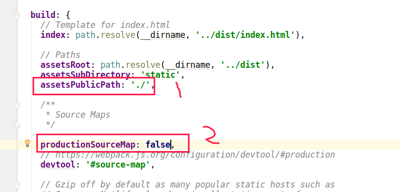

## 7、webpack的简单操作

webpack是一个前端的模块化打包(构建)的工具

它的特点是：webpack将一切繁杂的、重复的、机械的工作自动处理，开发者只需要关注于功能的实现的。

这一节只简单讲解一下怎么使用webpack打包。

### 7.1.打包（构建）做了哪些事：

- 1.语法转换

​    ES6--->ES5   供浏览器的解析

​    less/sass---->css   供浏览器的解析

​    TS------> ES5  供浏览器的解析

- 2.文件压缩和合并

  js / html /css 文件压缩，删除所有的注释和空格，变量名简写

  js / css 文件合并 ，将多个js文件或则css文件合并成一个js文件或则css文件

- 3.提供开发期间的服务器

  能够自动打开浏览器，监听文件变化，自动刷新浏览器的

 配置文件

### 7.2.配置文件

由于我们是用vue-cli快速创建的项目，很多配置文件都弄好了的。

主要配置文件有package.json 和 config文件夹下的文件，以及build文件夹下的文件

**config/index.js**  :  这个文件中配置了项目的一些基本信息，包括端口，host ，打包等相关信息都在这里面配置

**package.json**  :  项目信息，以及依赖的一些其他模块的版本等

### 7.3.怎么打包

基于vue-cli脚手架搭建的项目，首先在config/index.js中，要修改两个地方：



 第一个地方修改的就是静态文件的路径，打包后静态文件就在当前目录下，所以修改为./

第二个是环境设置为生产环境。

可以看出这里还设置了打包后的目录，将会放到dist目录下

**执行打包命令**：

在项目目录下执行命令：

```
npm run build

```

**怎么测试打的包**：

需要利用node中的express

1.安装express: npm install -g express;

2.创建一个express工程: express helloworld;

3.进入项目主目录: cd helloworld;

4.安装必备包: npm install;

5.启动程序: npm start;

6.把打包后的dist文件夹放在public文件夹里,访问http://localhost:3000/dist就能看到项目了,这样测试好了后,就可以丢后台了

 **多环境打包配置**

可参考https://zhuanlan.zhihu.com/p/46186706